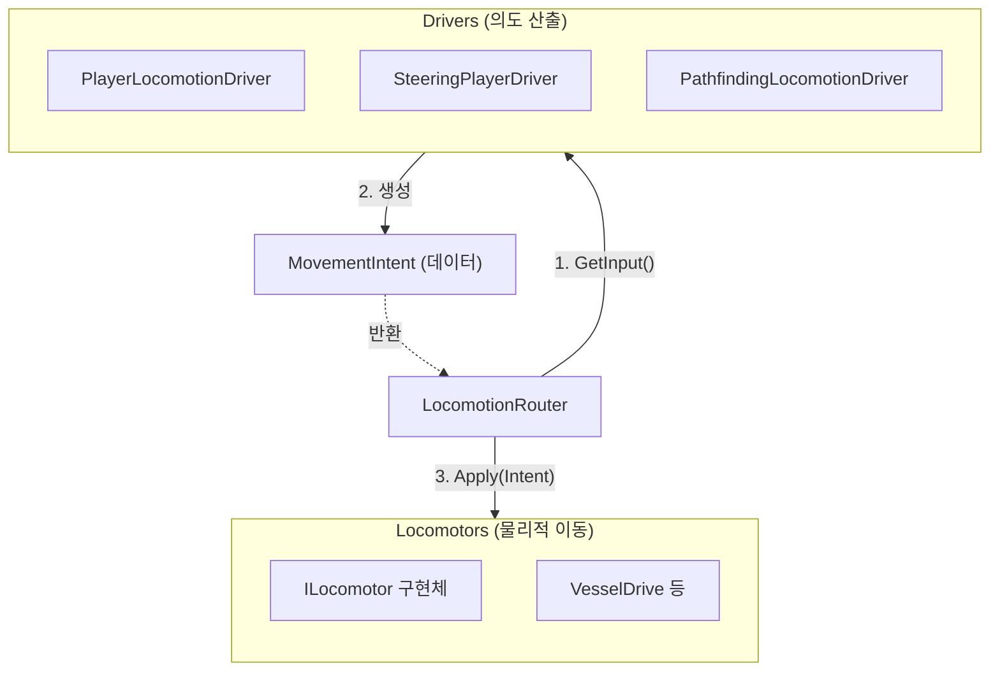
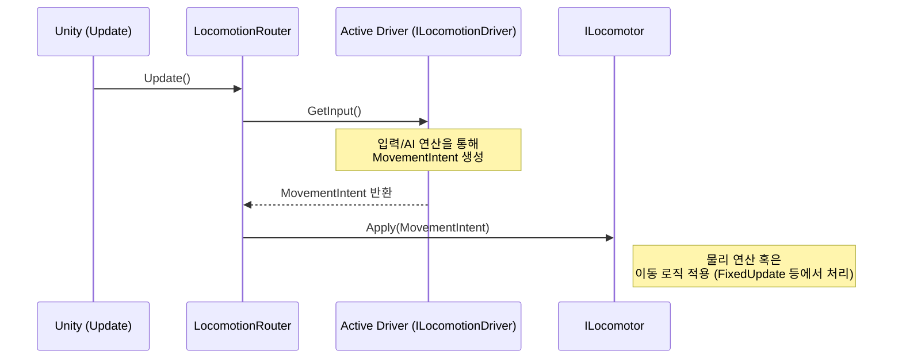

# 로코모션 시스템 (Locomotion System)

이동 의도(`MovementIntent`)를 생성하는 **Driver**와 물리적 이동을 담당하는 **Locomotor**를 분리하고, 이를 **Router**를 통해 조율하는 이동 파이프라인 시스템이다.

- **Driver → Router → Locomotor** 계층을 통해 플레이어 입력과 AI(길찾기 등) 입력을 통일된 방식으로 처리한다.
- `MovementIntent`를 통해 속도, 시선 방향, 점프 등의 이동 의도를 규격화한다.
- `LocomotionRouter` 단위에서 다수의 Driver를 등록하고 상황에 맞게 교체(`Engage`/`Disengage`)한다.

---

## 🏛 전체 아키텍처



---

## 🔄 이동 처리 흐름

매 프레임 `LocomotionRouter`가 작동하여 현재 활성화된 드라이버로부터 입력을 받아 로코모터에 전달한다.



---

## 📁 컴포넌트 맵

### 1. Core / Domain (기본 인터페이스 및 데이터)

| 파일 | 설명 |
|------|------|
| **`MovementIntent.cs`** | 속도(`Velocity`), 시선 방향(`LookDirection`), 점프 요청(`Jump`) 등을 담고 있는 읽기 전용 구조체. 드라이버와 로코모터 간의 통신 규격이다. |
| **`ILocomotionDriver.cs`** | 플레이어나 AI 로직으로부터 이동 의도를 추출하는 인터페이스 (`GetInput`, `Engage`, `Disengage`). |
| **`ILocomotor.cs`** | 물리적 이동을 수행하는 컴포넌트 인터페이스. `Apply(MovementIntent)`를 통해 이동 명령을 수행한다. |
| **`ISteerableLocomotor.cs`** | 회전(조향) 기반으로 움직이는 탈것 등을 위한 확장 인터페이스 (`MaxSteerAngle`, `SteerSpeed` 제공). |

### 2. Core / Infrastructure (라우팅)

| 파일 | 설명 |
|------|------|
| **`LocomotionRouter.cs`** | 매 프레임 `activeDriver.GetInput()`을 호출해 `locomotor.Apply()`로 전달하는 추상 기반 클래스. 드라이버 등록 및 교체 기능을 담당한다. |

### 3. Routers (라우터 구현체)

| 파일 | 설명 |
|------|------|
| **`CharacterLocomotionRouter.cs`** | 캐릭터용 라우터. 플레이어 가능 여부(`IsPlayable`)에 따라 `PlayerLocomotionDriver` 등을 교체한다. |
| **`VesselLocomotionRouter.cs`** | 탈것(수면 위 등)을 위한 라우터 구현체. |

### 4. Drivers (입력/의도 산출 구현체)

| 파일 | 설명 |
|------|------|
| **`PlayerLocomotionDriver.cs`** | 플레이어 입력(`IInputReader`)을 기반으로 이동 및 캐릭터 시점 회전 등을 처리하여 `MovementIntent`를 생성한다. |
| **`SteeringPlayerDriver.cs`** | 조향 장치가 있는 탈것(배 등)에 대한 플레이어 조작 드라이버. |
| **`PathfindingLocomotionDriver.cs`** | 길찾기(`FollowerEntityWrapper` 등) AI 로직으로부터 이동 의도를 추출하여 AI 캐릭터를 제어한다. |

### 5. Locomotors (물리적 이동 구현체)

| 파일 | 설명 |
|------|------|
| **`VesselDrive.cs`** | 수면 위에서 움직이는 탈것 이동체. Spring-Damper 방식을 이용해 선형/각속도 물리력을 적용한다. (`ISteerableLocomotor` 구현) |
| **`Floater.cs`** | 수면이나 특정 높이를 유지하도록 부력을 적용하는 로코모터 관련 컴포넌트로 추정. |

### 6. Pathfindings (길찾기 및 내비게이션 요소)

| 파일 | 설명 |
|------|------|
| **`INavigationSource.cs`** | 내비게이션의 목적지 설정 및 속도 조절 등을 정의하는 인터페이스. |
| **`SplineFollower.cs`** | 지정된 `Spline`을 따라 이동하는 경로 추적 컴포넌트. 가상 목적지 방식을 사용하여 부드러운 커브 이동을 구현한다. |

---

## 📁 폴더 구조

```text
Locomotion/
├── Core/
│   ├── Domain/
│   │   ├── ILocomotionDriver.cs
│   │   ├── ILocomotor.cs
│   │   ├── ISteerableLocomotor.cs
│   │   └── MovementIntent.cs
│   └── Infrastructure/
│       └── LocomotionRouter.cs
├── Drivers/
│   ├── PathfindingLocomotionDriver.cs
│   ├── PlayerLocomotionDriver.cs
│   └── SteeringPlayerDriver.cs
├── Locomotors/
│   ├── Floater.cs
│   └── VesselDrive.cs
├── Pathfindings/
│   ├── Domain/
│   └── Infrastructure/
│       └── SplineFollower.cs
└── Routers/
    ├── CharacterLocomotionRouter.cs
    └── VesselLocomotionRouter.cs
```


